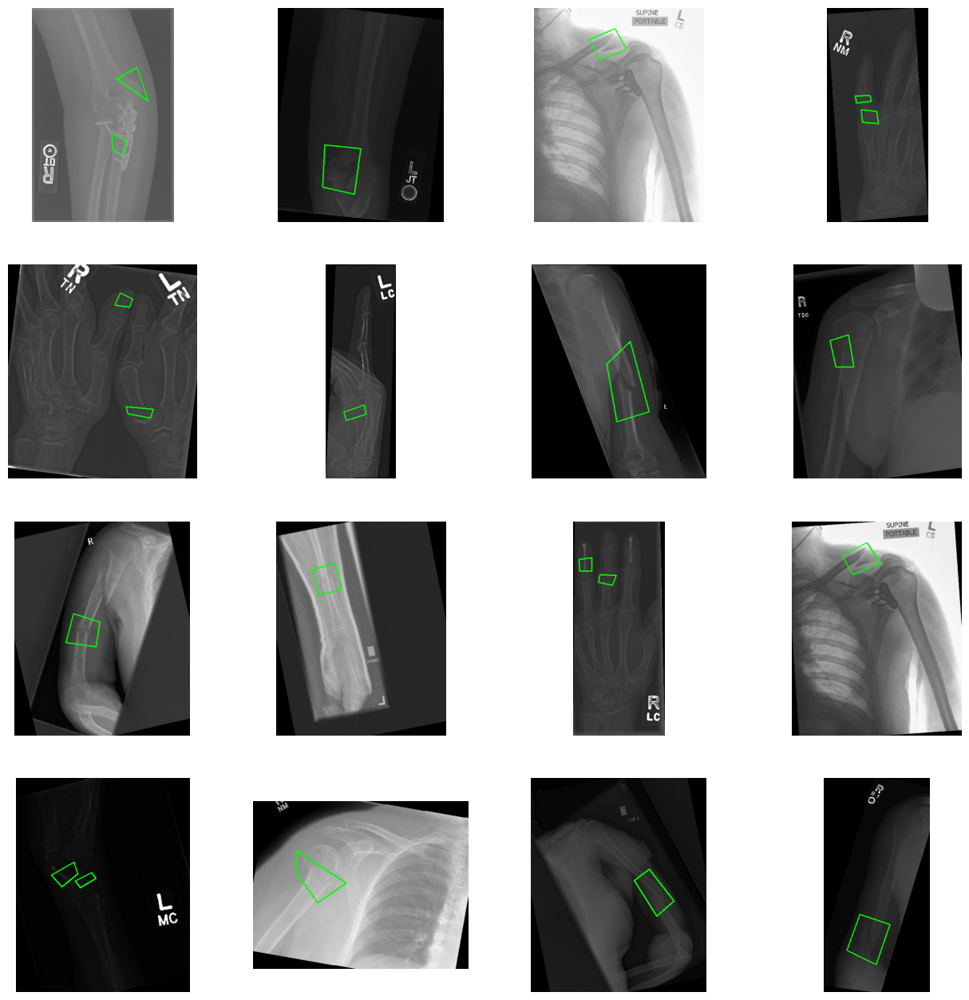

# Approccio sviluppato

## Dataset

Per la realizzazione di questo progetto è stato utilizzato il dataset "Bone Fracture Detection: Computer Vision Project" disponibile sulla piattaforma Kaggle (https://www.kaggle.com/datasets/pkdarabi/bone-fracture-detection-computer-vision-project). La collezione comprende immagini radiografiche rappresentanti vari tipi di fratture ossee, etichettate e annotate. Una caratteristica distintiva di questo dataset è la presenza, per ogni immagine radiografica, di un file di testo corrispondente contenente le coordinate della bounding box che delimita l'area della frattura. Questa annotazione granulare permette non solo di classificare la presenza di fratture, ma anche di localizzarle spazialmente all'interno dell'immagine, abilitando lo sviluppo di modelli sia di object detection che di classification. 

Le tipologie di fratture presenti nel dataset sono le seguenti:
- Elbow Positive
- Fingers Positive
- Forearm Fracture
- Humerus Fracture
- Shoulder Fracture
- Wrist Positive

Il dataset è gia suddiviso in 3 parti: una cartella di training, una di validazione e una di test. La cartella di training contiene 3631 immagini, quella di validazione 348 immagini e quella di test 169 immagini. Anche se la suddivisione del dataset non è ottimale si è deciso di utilizzarla per poter mantenere una metrica di misura rispetto alle altre soluzioni caricate su Kaggle che sfruttano questo dataset.

Le immagini sono in formato JPG e hanno dimenzioni varialbili, per questo motivo successivamente verra spiegato che e' stato necessario effettuare un resize delle immagini per poterle utilizzare per l'addestramento del modello.



nell'immagine sopra è possibile vedere un esempio di come sono strutturate le immagini del dataset, con le relative bounding box che delimitano le fratture ossee.

## Problematiche delle Bounding Box Standard

Vista la particolare conformazione delle bounding box presenti nel dataset, inizialmente si era considerata la possibilità di trasformarle in una versione standard, ovvero utilizzando le coordinate di un singolo punto di riferimento accompagnate da larghezza e altezza del rettangolo contenitore. Tuttavia, questo approccio presentava significative limitazioni: le bounding box risultanti erano eccessivamente grandi e spesso includevano ampie porzioni di sfondo non rilevante, creando un rapporto sfavorevole tra l'area dell'oggetto di interesse e l'area totale della bounding box. Questa sproporzione impediva alle reti neurali di convergere efficacemente durante il processo di addestramento, compromettendo le prestazioni del modello nella fase di detection degli oggetti target.

## Il Modello YOLOv8m-OBB

Per superare queste limitazioni, si è optato per l'adozione del modello YOLOv8m-OBB (Oriented Bounding Box), una variante specializzata della famiglia YOLO che supporta nativamente bounding box orientate e composte da un numero variabile di punti. YOLOv8m-OBB è specificamente progettato per gestire oggetti con forme irregolari o orientamenti arbitrari, utilizzando bounding box definite da poligoni che si adattano meglio alla geometria reale degli oggetti da rilevare. Questo modello permette di ottenere una localizzazione più precisa degli oggetti target, riducendo significativamente l'inclusione di background non rilevante e migliorando di conseguenza l'efficienza computazionale e l'accuratezza del processo di detection. La capacità di elaborare bounding box non orientate secondo gli assi cartesiani standard consente al modello di adattarsi ottimalmente alle caratteristiche geometriche specifiche del dataset, garantendo una convergenza più stabile durante l'addestramento.

## preprocessing delle immagini

Il preprocessing delle immagini ha rappresentato una fase cruciale per garantire l'uniformità dei dati in input al modello. Questa fase è stata suddivisa in due operazioni principali che hanno permesso di ottimizzare le prestazioni del modello YOLOv8m-OBB.

### normalizzazione delle immagini

Per tutte le immagini del dataset è stata applicata una normalizzazione dei valori pixel, operazione fondamentale per stabilizzare il processo di addestramento e migliorare la convergenza della rete neurale. La normalizzazione permette di uniformare la distribuzione dei valori di intensità luminosa, riducendo l'impatto delle variazioni di illuminazione e contrasto presenti nelle immagini originali. La funzione implementata opera nello spazio colore HSV, normalizzando specificamente il canale V (Value) che rappresenta l'intensità luminosa, mantenendo invariati i canali H (Hue) e S (Saturation) per preservare le informazioni cromatiche originali, la funzione accetta come input il percorso della cartella contenente le immagini a cui sara applicata a tutte la normalizzazione.

```python
def normalize_image(cartella_immagini):
    for file in os.listdir(cartella_immagini):
        if file.endswith(".jpg"):
            percorso_file = os.path.join(cartella_immagini, file)
            img = cv2.imread(percorso_file)
            hsv = cv2.cvtColor(img, cv2.COLOR_BGR2HSV)
            h, s, v = cv2.split(hsv)
            v = cv2.normalize(v, None, alpha=0, beta=255, norm_type=cv2.NORM_MINMAX)
            hsv_norm = cv2.merge([h, s, v])
            img_norm = cv2.cvtColor(hsv_norm, cv2.COLOR_HSV2BGR)
            cv2.imwrite(percorso_file, img_norm)
    print("Elaborazione completata!")
```

### Resize delle immagini

Per garantire una corretta elaborazione delle immagini da parte del modello YOLOv8m-OBB, ciascuna immagine è stata uniformata in termini di dimensioni attraverso un processo di ridimensionamento con mantenimento delle proporzioni, seguito dall'applicazione di padding nero. Questo approccio ha permesso di evitare distorsioni geometriche che avrebbero potuto compromettere l'accuratezza del modello nella localizzazione degli oggetti. La tecnica del padding consente di ottenere immagini perfettamente quadrate, preservando le proporzioni originarie degli oggetti. Successivamente, tutte le immagini sono state ridimensionate a una risoluzione standard di 640×640 pixel, scelta che rappresenta un buon compromesso tra qualità visiva e prestazioni computazionali in fase di inferenza. Le coordinate dei bounding box sono state correttamente adattate in base alla trasformazione subita dall’immagine, assicurando così la coerenza tra le annotazioni e i nuovi riferimenti spaziali.

```python
def resize_with_padding(image, target_size):
    """
    Ridimensiona l'immagine mantenendo le proporzioni e aggiungendo padding nero
    per raggiungere la dimensione target (es. 640x640), senza distorcere l'immagine.
    """
    old_h, old_w = image.shape[:2]
    target_w, target_h = target_size

    # Calcola il fattore di scala mantenendo il rapporto d'aspetto originale
    scale = min(target_w / old_w, target_h / old_h)
    new_w = int(old_w * scale)
    new_h = int(old_h * scale)

    # Ridimensiona l'immagine mantenendo le proporzioni
    resized_image = cv2.resize(image, (new_w, new_h), interpolation=cv2.INTER_LINEAR)

    # Calcola il padding necessario per centrare l'immagine nella nuova dimensione
    pad_w = (target_w - new_w) // 2
    pad_h = (target_h - new_h) // 2

    # Applica il padding nero ai bordi
    padded_image = cv2.copyMakeBorder(
        resized_image,
        pad_h, target_h - new_h - pad_h,
        pad_w, target_w - new_w - pad_w,
        cv2.BORDER_CONSTANT,
        value=[0, 0, 0]
    )

    return padded_image, scale, pad_w, pad_h


def update_labels(labels_path, scale, pad_w, pad_h, old_w, old_h, target_size):
    """
    Aggiorna le coordinate normalizzate (YOLO format xywh) delle etichette
    in base al ridimensionamento e padding applicato all'immagine.
    """
    target_w, target_h = target_size
    updated_labels = []

    with open(labels_path, 'r') as file:
        lines = file.readlines()

    for line in lines:
        parts = line.strip().split()
        class_id = parts[0]
        label_parts = list(map(float, parts[1:]))

        # Aggiorna le coordinate (x, y) e dimensioni (w, h) relative
        for j in range(0, len(label_parts), 2):
            label_parts[j] = (label_parts[j] * old_w * scale + pad_w) / target_w
            label_parts[j + 1] = (label_parts[j + 1] * old_h * scale + pad_h) / target_h

        updated_labels.append(f"{class_id} " + " ".join(map(str, label_parts)) + "\n")

    # Sovrascrive il file con le nuove etichette aggiornate
    with open(labels_path, 'w') as file:
        file.writelines(updated_labels)


def process_folder(images_folder, labels_folder, target_size=(640, 640)):
    """
    Applica il ridimensionamento con padding a tutte le immagini della cartella,
    e aggiorna le rispettive etichette per mantenerle corrette rispetto alle nuove dimensioni.
    """
    for filename in os.listdir(images_folder):
        if filename.lower().endswith(('.png', '.jpg', '.jpeg')):
            image_path = os.path.join(images_folder, filename)
            labels_path = os.path.join(labels_folder, os.path.splitext(filename)[0] + '.txt')

            image = cv2.imread(image_path)
            if image is None:
                print(f"Errore nel leggere l'immagine: {image_path}")
                continue

            old_h, old_w = image.shape[:2]
            resized_image, scale, pad_w, pad_h = resize_with_padding(image, target_size)

            # Se esiste un file di etichette, aggiorna le coordinate
            if os.path.exists(labels_path):
                update_labels(labels_path, scale, pad_w, pad_h, old_w, old_h, target_size)

            # Sovrascrive l'immagine con quella ridimensionata
            cv2.imwrite(image_path, resized_image)
```

Il codice riportato implementa un processo automatizzato per la preparazione di dataset di immagini e relative annotazioni in formato YOLO. In particolare, la funzione process_folder itera su tutte le immagini di una cartella, applicando il ridimensionamento con padding tramite resize_with_padding, che preserva il rapporto d’aspetto originale evitando distorsioni. Dopo il ridimensionamento, la funzione update_labels ricalcola le coordinate dei bounding box per adattarle alla nuova risoluzione, tenendo conto della scala applicata e del padding aggiunto. Questo garantisce che le annotazioni restino accurate e coerenti con le immagini modificate. L’intero processo avviene in-place, ovvero sovrascrivendo le immagini e i file di etichette originali, evitando la creazione di duplicati e mantenendo ordinata la struttura del dataset. Tale approccio è particolarmente utile per garantire la compatibilità con modelli deep learning, come YOLOv8m-OBB, che richiedono input standardizzati.

### Data Augmentation

Per migliorare la capacità generalizzativa del modello e aumentare la varietà dei dati disponibili durante l’addestramento, si è scelto di applicare una strategia di data augmentation basata sulla rotazione delle immagini e delle relative annotazioni. In particolare, è stata definita una funzione (process_images_labels) che consente di generare nuove versioni delle immagini ruotandole di 90°, 180° o 270°, preservando l'informazione spaziale degli oggetti tramite un aggiornamento coerente delle etichette nel formato YOLO. Questo aggiornamento è gestito dalla funzione rotate_label, che ricalcola le coordinate normalizzate dei bounding box in base all’angolo di rotazione, mantenendo l’allineamento corretto tra immagine e annotazione.

```python
def rotate_label(label_path, new_label_path, angle):
    with open(label_path, 'r') as file:
        lines = file.readlines()
    new_lines = []
    for line in lines:
        parts = line.strip().split()
        class_id = parts[0]
        coords = list(map(float, parts[1:]))
        new_coords = []
        for i in range(0, len(coords), 2):
            x, y = coords[i], coords[i+1]
            if angle == 90:
                new_x, new_y = 1 - y, x
            elif angle == 180:
                new_x, new_y = 1 - x, 1 - y
            elif angle == 270:
                new_x, new_y = y, 1 - x
            else:
                raise ValueError("Unsupported angle")
            new_coords.extend([new_x, new_y])
        new_lines.append(f"{class_id} " + " ".join(map(str, new_coords)) + "\n")
        with open(new_label_path, 'w') as file:
            file.writelines(new_lines)

def process_images_labels(image_folder, label_folder, angles):
    angles = [90, 180, 270]
    for label_file in os.listdir(label_folder):
        if not label_file.endswith('.txt'):
            continue
        label_path = os.path.join(label_folder, label_file)
        image_path = os.path.join(image_folder, label_file.replace('.txt', '.jpg'))
        if os.path.exists(image_path):
            with open(label_path, 'r') as f:
                if f.read().strip():
                    image = cv2.imread(image_path)
                    for angle in angles:
                        rotated_image = cv2.rotate(image, {90: cv2.ROTATE_90_CLOCKWISE,
                                                           180: cv2.ROTATE_180,
                                                           270: cv2.ROTATE_90_COUNTERCLOCKWISE}[angle])
                        new_image_path = os.path.join(image_folder, label_file.replace('.txt', f'_rotated{angle}.jpg'))
                        cv2.imwrite(new_image_path, rotated_image)
                        new_label_path = os.path.join(label_folder, label_file.replace('.txt', f'_rotated{angle}.txt'))
                        rotate_label(label_path, new_label_path, angle)
```

Per evitare un eccessivo aumento della dimensione del dataset — che avrebbe potuto portare a un overfitting sul training set — si è optato per una rotazione limitata a 180°, sufficiente a incrementare la varietà delle immagini senza compromettere l’equilibrio tra complessità e generalizzazione. Il processo è stato attivato tramite la chiamata:

```python
process_images_labels(train_images, train_labels, angles=[180])
```

Questa procedura ha permesso di raddoppiare il numero di esempi nel set di addestramento, introducendo varianti che il modello può incontrare nel mondo reale (es. oggetti capovolti), contribuendo così a una maggiore robustezza durante l’inferenza.

### funzioni di preprocessing scartate

Durante la fase di pre-processing è stata inizialmente testata una funzione dedicata alla correzione automatica del contrasto delle immagini radiografiche tramite l’algoritmo CLAHE (Contrast Limited Adaptive Histogram Equalization). La funzione , applicata alle immagini della cartella di input, mirava ad aumentare la visibilità dei dettagli nelle immagini, specialmente in presenza di basse differenze di luminosità.

Nonostante le basi teoriche solide e la buona riuscita tecnica dell’applicazione (con successo su tutte le immagini processate), i risultati ottenuti in fase di addestramento non hanno mostrato miglioramenti significativi nelle performance del modello. In alcuni casi, l’eccessiva enfatizzazione dei bordi introdotta dal CLAHE sembrava addirittura disturbare il processo di localizzazione degli oggetti, compromettendo la qualità dell’apprendimento.

Alla luce di queste considerazioni, si è deciso di non includere questa fase nel pre-processing finale, preferendo mantenere le immagini nel loro contrasto originale, più vicino alle condizioni reali del dominio radiografico in cui il modello verrà utilizzato. Questo esempio sottolinea l'importanza della sperimentazione nel processo di sviluppo: non tutte le trasformazioni, pur valide a livello teorico, si traducono automaticamente in benefici pratici nel contesto specifico del deep learning.


Nelle immagini sopra si puo notare la differenza tra quelle di simistra che sono le immagini originali e quelle di destra che sono state preprocessate con l'algoritmo CLAHE. Si puo notare come le immagini preprocessate abbiano un contrasto piu elevato, che pero non e' stato utile per il modello.

## Addestramento del modello

L’addestramento del modello è stato eseguito utilizzando i pesi pre-addestrati e ottimizzati per bounding box orientati, impiegando la funzione `train()` della libreria Ultralytics. Il processo ha utilizzato il dataset opportunamente annotato e preprocessato, seguendo i parametri riportati di seguito:

- **`task='detect'`**: specifica che il modello è stato addestrato per un compito di *object detection*.
- **`mode='train'`**: imposta il modello in modalità addestramento.
- **`data='BoneFractureYolo8/data.yaml'`**: percorso del file YAML contenente le informazioni sul dataset, classi, e suddivisione training/validation.
- **`epochs=18`**: numero di epoche selezionato per garantire un equilibrio tra accuratezza e tempo computazionale.
- **`seed=42`**: fissato per assicurare la riproducibilità dei risultati.
- **`imgsz=640`**: risoluzione a cui le immagini sono state ridimensionate, coerente con il pre-processing e compatibile con YOLOv8.

Questa configurazione ha permesso di ottenere un buon compromesso tra accuratezza, robustezza e tempo di addestramento.

### metriche di valutazione

Nella immagine seguente sono riportate le metriche di valutazione ottenute durante l'addestramento del modello. Si osserva che molto velocemente la loss del validation set inizia a crescere mentando la differenza tra training e validation, segno di un possibile overfitting. Per questo motivo il modello finale che e' stato scelto è quello ottenuto alla fine della tredicesima epoca, un compromesso tra la loss del training set e quella sul validation set.


## Indicatori di Prestazione Utilizzati

Per valutare in modo rigoroso e completo le performance del modello di rete neurale sviluppato per il riconoscimento di fratture ossee, sono stati impiegati diversi indicatori di prestazione standard nel campo del machine learning e della computer vision. La selezione di queste metriche è stata guidata dalla necessità di ottenere una valutazione multidimensionale che consideri sia gli aspetti di classificazione che quelli di localizzazione spaziale, elementi entrambi cruciali per un sistema di diagnostica medica. Gli indicatori principali utilizzati comprendono Precision, Recall, mAP50 e mAP50-95, ciascuno dei quali fornisce informazioni specifiche e complementari sulle capacità del modello.

### Precision
La Precision rappresenta la frazione di predizioni positive che risultano effettivamente corrette, calcolata come il rapporto tra i veri positivi e la somma di veri positivi e falsi positivi (TP/(TP+FP)). Nel contesto del riconoscimento di fratture ossee, questa metrica indica la capacità del modello di evitare falsi allarmi, misurando quanto spesso una regione identificata dal sistema come contenente una frattura sia effettivamente fratturata. Una alta precision è fondamentale in applicazioni mediche per evitare diagnosi errate che potrebbero portare a trattamenti non necessari, stress del paziente e spreco di risorse sanitarie. Nei modelli di classificazione, la precision valuta l'accuratezza delle predizioni positive, mentre nei modelli di object detection come quelli utilizzati per la localizzazione di fratture, considera anche la corretta identificazione spaziale delle bounding box.

### Recall
Il Recall, anche noto come sensibilità, misura la frazione di casi positivi reali che vengono correttamente identificati dal modello, calcolato come il rapporto tra veri positivi e la somma di veri positivi e falsi negativi (TP/(TP+FN)). In termini clinici, questa metrica quantifica la capacità del sistema di non "perdere" fratture effettivamente presenti, rappresentando un indicatore critico per la sicurezza del paziente. Un recall elevato è particolarmente importante nella diagnostica medica poiché una frattura non diagnosticata può comportare gravi conseguenze per il paziente, inclusi dolore prolungato, complicazioni e danni permanenti. Nei modelli di classificazione, il recall valuta la completezza del riconoscimento, mentre nei sistemi di detection considera la capacità di individuare tutte le istanze di fratture presenti nell'immagine, indipendentemente dalla loro posizione o dimensione.

### mAP50 
La metrica mAP50 rappresenta la media delle Average Precision calcolate per tutte le classi del modello, utilizzando una soglia di Intersection over Union (IoU) pari a 0.5. L'IoU misura la sovrapposizione tra la bounding box predetta dal modello e quella reale annotata nei dati di ground truth, con 0.5 che rappresenta una soglia relativamente permissiva che considera corretta una predizione con almeno il 50% di sovrapposizione. Questa metrica è particolarmente rilevante per i modelli di object detection poiché valuta simultaneamente la capacità di classificazione e localizzazione spaziale. Nel contesto del riconoscimento di fratture, mAP50 fornisce un indicatore bilanciato delle performance del modello, considerando sia l'accuratezza nell'identificazione delle fratture che la precisione nella loro localizzazione anatomica. Questa soglia relativamente conservativa è clinicamente significativa poiché una localizzazione approssimativa ma corretta della frattura può comunque fornire informazioni diagnostiche utili per il clinico.

### mAP50-95 

La metrica mAP50-95 estende il concetto di mAP calcolando la media delle Average Precision su un range di soglie IoU che va da 0.5 a 0.95 con incrementi di 0.05. Questa metrica più rigorosa fornisce una valutazione più stringente della qualità della localizzazione spaziale, penalizzando le predizioni che, pur essendo sostanzialmente corrette, presentano imprecisioni nella delimitazione delle bounding box. Nel contesto medico, mAP50-95 è particolarmente prezioso per valutare la precisione geometrica del modello, aspetto fondamentale per applicazioni dove la localizzazione esatta della frattura può influenzare decisioni terapeutiche specifiche, come la pianificazione di interventi chirurgici o la valutazione dell'estensione del danno. Nei modelli di regressione applicati alla localizzazione, questa metrica valuta la capacità di predire con alta precisione le coordinate delle bounding box, mentre nei sistemi di classificazione con componenti di localizzazione, misura l'accuratezza complessiva del sistema nel fornire informazioni spaziali dettagliate e clinicamente rilevanti