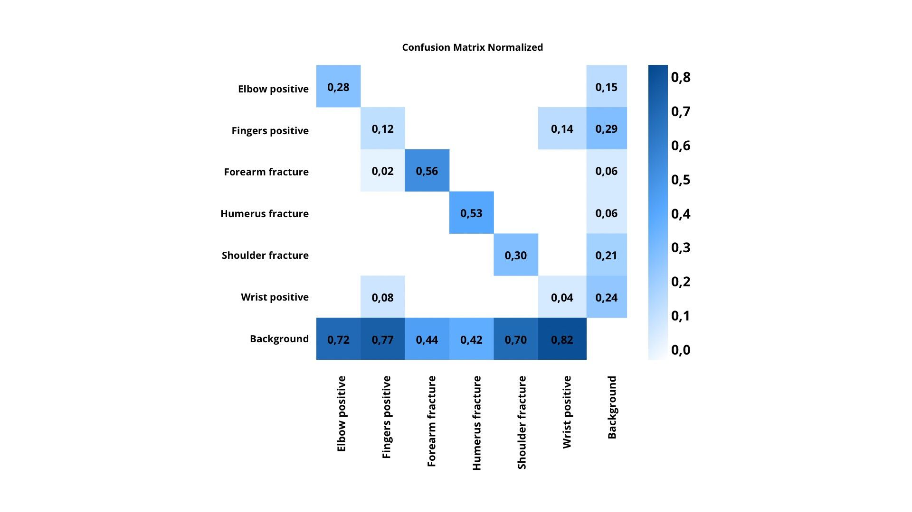
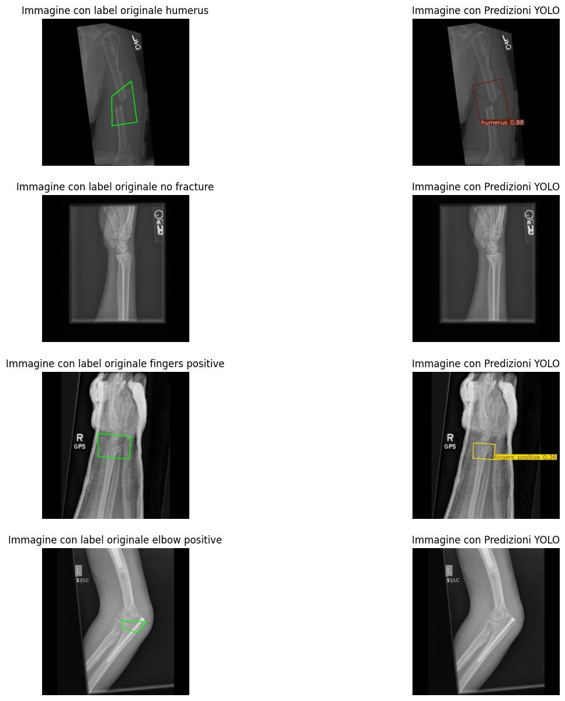
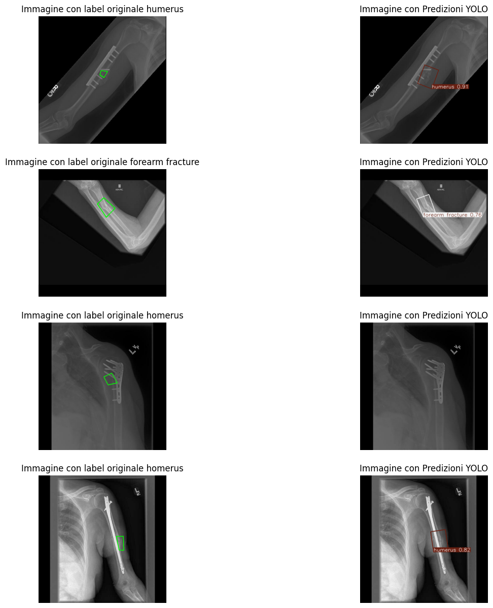

# Valutazioni sperimentali

La rete neurale addestrata per il compito di **object detection** è stata valutata su un **set di test** composto da **169 immagini** contenenti **96 istanze complessive** di oggetti di interesse.

Le prestazioni complessive del modello risultano **moderate**, con:
- **mAP@0.5** = `0.392`
- **mAP@0.5:0.95** = `0.203`

Il valore più basso della **mAP@0.5:0.95** indica una minore accuratezza quando si considerano criteri di localizzazione più stringenti.

La **recall globale** = `0.287` segnala che il modello tende a **non rilevare tutte le istanze presenti**, mentre la **precisione globale** = `0.546` suggerisce una **buona capacità di evitare falsi positivi** nelle predizioni.

---

| Classe            | Immagini | Istanze | Precisione | Recall | mAP@0.5 | mAP@0.5:0.95 |
|-------------------|----------|---------|------------|--------|---------|--------------|
| **all**           | 169      | 96      | 0.546      | 0.287  | 0.392   | 0.203        |
| elbow positive    | 13       | 17      | 0.000      | 0.000  | 0.000   | 0.000        |
| fingers positive  | 22       | 27      | 0.636      | 0.259  | 0.424   | 0.189        |
| forearm fracture  | 13       | 14      | 0.857      | 0.429  | 0.673   | 0.404        |
| humerus           | 14       | 15      | 0.875      | 0.467  | 0.642   | 0.328        |
| shoulder fracture | 15       | 17      | 0.571      | 0.235  | 0.353   | 0.155        |
| wrist positive    | 6        | 6       | 0.333      | 0.333  | 0.261   | 0.139        |

---

I migliori risultati si osservano nelle classi **forearm fracture** e **humerus**, che raggiungono rispettivamente:
- **mAP@0.5** = `0.673` e `0.642`
- **Precisione** > `0.85`
- **Recall** accettabile

Al contrario, la classe **elbow positive** mostra prestazioni **nulle**, segnalando una **mancata capacità del modello di rilevare correttamente** questa categoria.

Le prestazioni delle altre classi evidenziano **margini di miglioramento**, soprattutto nella **capacità di identificare tutte le istanze rilevanti** (*recall*).

---

La **matrice di confusione** normalizzata ottenuta sul *validation set* evidenzia un aspetto critico:  
in numerosi casi il modello **non effettua alcuna predizione** per le istanze presenti, assegnando implicitamente gran parte dell'immagine alla classe di **background**.

Questo fenomeno si traduce in un **elevato numero di falsi negativi**, poiché le regioni contenenti oggetti di interesse non vengono riconosciute.

---

## Esempi di Predizione

Di seguito sono riportati alcuni esempi di predizioni effettuate dal modello, che mostrano sia **casi di successo** che **fallimenti** nella rilevazione delle fratture ossee.

Le immagini evidenziano:
- aree correttamente identificate
- predizioni errate o mancate

---

## Valutazione delle prestazioni

Le prestazioni globali del modello risultano **nel complesso accettabili**, con:
- **Precisione generale** = `0.546` → discreta capacità di generare predizioni corrette rispetto ai falsi positivi

Ottimi risultati sono stati ottenuti per:
- **forearm fracture** → Precisione `0.857`
- **humerus** → Precisione `0.875`

Al contrario:
- **elbow positive** → Precisione `0.000` e Recall `0.000` → incapacità di rilevare la classe

---

Per quanto riguarda:
- **mAP@0.5** = `0.392`
- **mAP@0.5:0.95** = `0.203`

Questi valori **non sono da considerarsi negativi**.  
Sono influenzati dalla **qualità e regolarità delle bounding box** nel dataset:
- la **non uniformità** o **imprecisione nelle annotazioni** può penalizzare la valutazione
- la **mAP@0.5:0.95** è particolarmente sensibile a errori di localizzazione

Di conseguenza, punteggi non elevati **non riflettono necessariamente una scarsa capacità del modello**, ma piuttosto **limitazioni intrinseche** del dataset di validazione.
