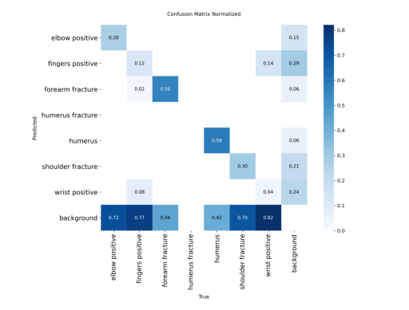

# Valutazioni sperimentali

La rete neurale addestrata per il compito di object detection è stata valutata su un set di test composto da 169 immagini contenenti 96 istanze complessive di oggetti di interesse. Le prestazioni complessive del modello risultano moderate, con un valore medio di precisione (mAP@0.5) pari a 0.392 e un mAP@0.5:0.95 più basso, pari a 0.203, che indica una minore accuratezza quando si considerano criteri di localizzazione più stringenti. La recall globale (0.287) segnala che il modello tende a non rilevare tutte le istanze presenti, mentre la precisione globale (0.546) suggerisce una buona capacità di evitare falsi positivi nelle predizioni effettuate.

| Classe            | Immagini | Istanza | Precisione | Recall | mAP\@0.5 | mAP\@0.5:0.95 |
|-------------------| -------- | ------- | ---------- | ------ | -------- | ------------- |
| all               | 169      | 96      | 0.546      | 0.287  | 0.392    | 0.203         |
| elbow positive    | 13       | 17      | 0.000      | 0.000  | 0.000    | 0.000         |
| fingers positive  | 22       | 27      | 0.636      | 0.259  | 0.424    | 0.189         |
| forearm fracture  | 13       | 14      | 0.857      | 0.429  | 0.673    | 0.404         |
| humerus           | 14       | 15      | 0.875      | 0.467  | 0.642    | 0.328         |
| shoulder fracture | 15       | 17      | 0.571      | 0.235  | 0.353    | 0.155         |
| wrist positive    | 6        | 6       | 0.333      | 0.333  | 0.261    | 0.139         |

I migliori risultati si osservano nelle classi forearm fracture e humerus, che raggiungono una mAP@0.5 rispettivamente di 0.673 e 0.642, con buona precisione e recall accettabile. Al contrario, la classe elbow positive mostra prestazioni nulle, segnalando una mancata capacità del modello di rilevare correttamente questa categoria. Le prestazioni sulle restanti classi evidenziano margini di miglioramento, soprattutto per quanto riguarda la capacità del modello di identificare tutte le istanze rilevanti (recall).

La matrice di confusione normalizzata ottenuta sul validation set evidenzia un aspetto critico del comportamento del modello: in numerosi casi, esso non effettua alcuna predizione per le istanze presenti, assegnando implicitamente gran parte dell'immagine alla classe di "background". Questo fenomeno si traduce in un elevato numero di falsi negativi, poiché le regioni contenenti oggetti di interesse non vengono riconosciute come tali.

## Esempi di Predizione

Di seguito sono riportati alcuni esempi di predizioni effettuate dal modello, che mostrano sia casi di successo che di insuccesso nella rilevazione delle fratture ossee. Le immagini evidenziano le aree in cui il modello ha identificato correttamente gli oggetti di interesse, nonché i casi in cui le predizioni non sono state accurate.

